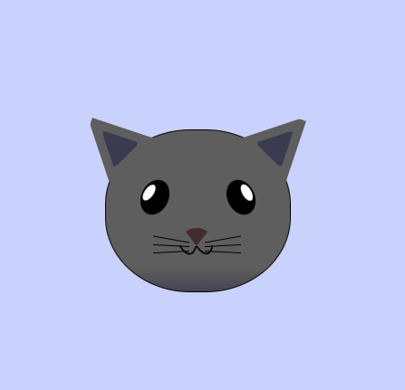

# Cat Painting (learn Intermediate CSS)

This Repository contains a Cat Painting Project which is helpfull in learning Intermediate CSS.

I learned this from [freeCodeCamp's](https://www.freeCodeCamp.com) Repsonsive Web Design Certificatin Course.

### Cat Painting

This is what I made in this project : 

